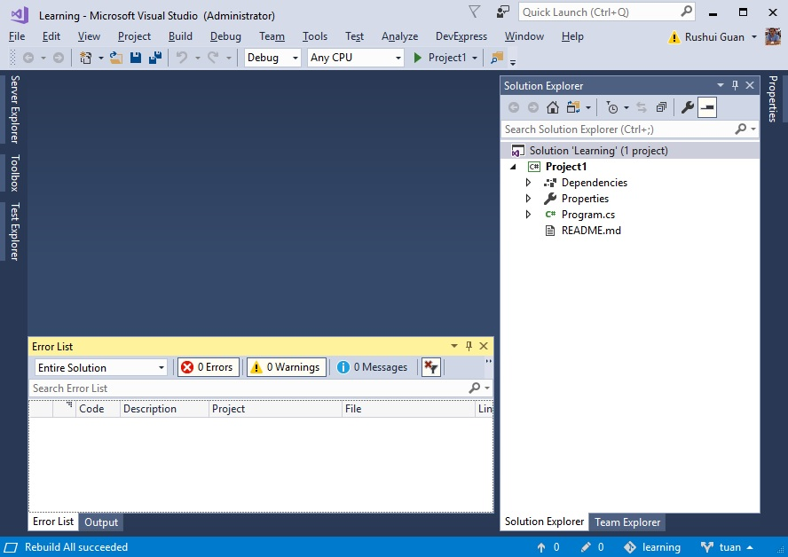

# Project 1

# Summary
Open the Project 1 using Visual Studio and Learn about the Visual Studio IDE (Integrated Development Environment)

# The Solution
* Read: [Visual Studio Wiki Page](https://en.wikipedia.org/wiki/Microsoft_Visual_Studio)
* Double click on the file `/c/github/learning/src/Project1/Learning.sln`
    * Visual Studio 2017 should launch.  If it is the first time, it might prompt you to login.  Use the outlook email credential to login.  You can also login using the button on the upper right corner.
    * 
* Observe: The solution tab within Visual Studio.
    * The Learning.sln file is a visual studio solution.
    * A solution file can contain many projects.
    * Currently there is only one project - Project1
        * If you open the folder: `/c/github/learning/src/project1`, you can find the project file with the extension of .csproj.
* A project represents a program.  There are different kinds of programs.  Some are Web programs served by a web server, others are console programs that can be executed on a shell.
    * Project1 is a console program.

# The Project
* A project can contain many files.  Different files have different purposes.
    * README.md file - That's this file!  md stands for Mark Down.  It is a popular file format used to create documents.  It is widely adopted by many web sites and companies.  Here is a guide for [Github Markdown](https://guides.github.com/features/mastering-markdown/).
    * Dependencies - A group of files that are required for this project to function properly.
    * Properties - Project settings and configurations;  Something that will be visited later.
    * Program.cs - The Source code.  This is where you write your program.  
    
# The Source Code
    * A project could have many source code files.  Let's take a look at the Program.cs file

```csharp
//This is a comment; comment is created by leading double slashes
/* 
this is also a comment;
The comment section can be multiple lines
*/

// multiline comment can be created by using /* and */
// however, It is standard to use leading // for all comments.

//the souce code is referencing the System module.
using System;

//this is the namespaces
namespace Project1 {

    //this is the class
    public class Program
    { 
        //this is a method
        static int Main(string[] args) {
            Console.WriteLine("Hello World!");
            return 0;
        }
    }
}
```

## The Names
When it comes to programming, lots of names are used.  Meaningful names are important whether it is for a class, variable or method.  In most languages, names should be made of alphanumeric plus the underline characters.  The first character of a name cannot be numeric.  So here are some examples
```
//legal names
cat, _cat, CAT, Cat, cat0, _cat_0, _cat0_,

//illegal names
0cat, _ cat, cat^, cat_%, cat paw
```
## Namespaces
Namespace is a way to organize your code.  It can be delimited using dot.  This is a legal namespace: `CompanyName.ProjectName`.  Please read this [article](https://docs.microsoft.com/en-us/dotnet/csharp/programming-guide/namespaces/index) about namespaces.

## Classes
Class is a construct that enables you to create your custom types.  Please read this [article](https://docs.microsoft.com/en-us/dotnet/csharp/programming-guide/classes-and-structs/classes).

## Method
Method is a code block that contains a series of statements.  A C# program does all of its work by running its methods.

# Build the Program
To get the program working, it will have to be built.  During the build process, the computer will analyse your code and check for errors.  If everything is fine, it should produce an output file that can run.

Start the build process by right clicking on the project and click "Build".  You can also type Ctrl-Shift-B on your keyboard.  You should be seeing activities on the output panel docked at the bottom of the visual studio.  Once the build is completed, its output can be found in this folder: `/c/github/learning/src/project1/bin/debug/net462/`.  Open the folder and find the program output.  It should be:
* Project1.exe - this is the exe file, this is the file that can be run.
* Project1.pdb - this is a symbol file.

# Execute the output
* Using your bash shell, execute the file by typing this command: `/c/github/learning/src/project1/bin/debug/net462/Project1.exe`.
* A quicker way to run your program is to press: Ctrl-F5 using Visual Studio.

# Exercise
## Make some changes
* Change the name of the class.
* Change the name of the namespace.
* Build and run again to see if you break anything.
* Change the name of the Main method.
    * Did this break something?
    * Could you find out why using google?
    * If not, it is OK, change the name back.
* Change the "Hello World" to something else.
    * Build and run to see if your change work.

## Commit your change and push it to the cloud
* Follow the instruction here: [Make a change](../../Setup.md#make-a-change)

